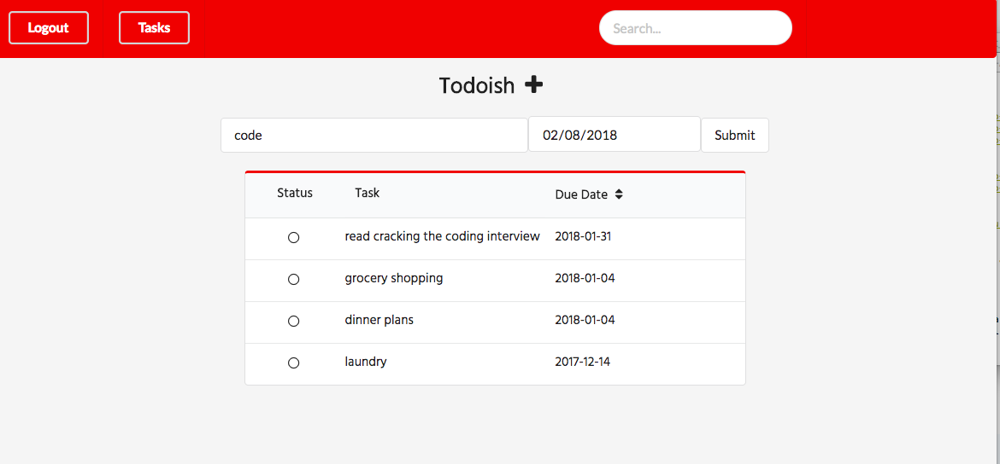

<h1> Todoish </h1>
Task Management web application that enables users to view, create, edit, and delete Tasks along with search and sort Tasks.  
 
See demo here: https://www.youtube.com/edit?o=U&video_id=n5iswnNfi6Y  
 

<h2> Getting Started </h2>  
These instructions will get you a copy of the project up and running on your local machine for development and testing purposes. See deployment for notes on how to deploy the project on a live system.  

<h2> Prerequisites </h2>
<ul>
  <li> Front-End: https://github.com/mrahman1/Mod-4-Final-Project-Client </li>
  <li> Back-End: https://github.com/mrahman1/Mod-4-Final-Project-Back-End </li>
</ul>

<h2> Installing </h2>
<ol>
  <li> Clone back end repo </li>
  <li> Clone front end repo </li>
</ol>

<h2> Deployment </h2>
<ol>
  <li> Launch rails server </li>
  <li> Launch front end on a separate server with Yarn install && start <li>
</ol>

<h2> Built With </h2>  
React - The Javascript library used to build the front-end  
Rails - The Ruby library used to build the back-end  
Semantic UI - The Theming guide used to style the front end  

<h2> Authors </h2>  
Mimi Rahman

<h2> License </h2>  
This project is licensed under the MIT License - see the LICENSE.md file for details
